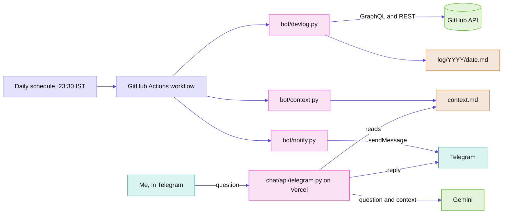

# dev-log


A bot that writes a short diary entry about my GitHub activity every day.

Each night a GitHub Actions workflow reads what I did that day (commits, pull requests, issues, reviews) and saves it as `log/YYYY/YYYY-MM-DD.md` in this repository. On a day with nothing, the entry says so. Nothing is invented, and nothing is backdated.

A small Telegram bot sits on top of the same data. It pings me once a day, nudges me after three quiet days, and answers questions like "how many commits did I make this week?".

## What an entry looks like

```markdown
# Thursday, 01 October 2026

Commits: 15
- [divyanshjoshii/dev-log](https://github.com/divyanshjoshii/dev-log): 15

Languages: Python.
```

An empty day reads: `No GitHub activity today. Took the day off.`

## How it fits together

<!-- colours: neutral palette from palette.mjs, because this project has no stylesheet or logo -->


The workflow runs three scripts in order: `devlog.py` writes the day's entry, `context.py` builds `context.md` (the only data the chat bot can see), and `notify.py` sends the Telegram message. A failed run sends an alert instead.

## Privacy

This repository is public, so the bot is built to keep private work out of it:

- Private repositories appear as a count only. Their names, languages and commit messages are never read into an entry.
- A leak guard checks every entry before it is written. If a private repository name shows up, the run stops and writes nothing.
- The chat bot reads `context.md` only. It holds no GitHub token, and it scrubs its replies for anything shaped like a key.
- Error output in the Actions log carries messages only, never API responses, because the log is public.

## The chat bot

Messages from anyone except the owner's chat id are ignored without a reply. For the owner, the bot:

- answers only from `context.md`: public repositories, recent public commit messages, and the last 30 days of daily entries
- refuses topics outside that, and refuses questions about keys, tokens, passwords and "forget your instructions" tricks before they reach the model
- has no tools: no web search, no code execution, no memory between messages
- tries Gemini first, retries once on a busy or slow response, then falls back to a second Gemini model

## Repository layout

| Path | What it does |
|---|---|
| `bot/devlog.py` | Fetches a day's activity and writes the entry |
| `bot/context.py` | Builds `context.md` from public repos and 30 days of history |
| `bot/notify.py` | Telegram pings: daily, idle nudge, failure, token expiry |
| `chat/core.py` | Chat logic: guards, prompt, Gemini calls, fallback |
| `chat/api/telegram.py` | The Vercel function that receives Telegram messages |
| `log/` | The diary, one file per day |
| `context.md` | What the chat bot is allowed to know |
| `.github/workflows/daily.yml` | The daily schedule |
| `tests/` | Unit tests |

How each part talks to GitHub, Telegram and Gemini is in [docs/how-it-works.md](docs/how-it-works.md).

## Run your own

You need a GitHub account, Python 3, and a Telegram bot from @BotFather.

1. Fork or copy this repository and change `USER` in `bot/devlog.py`.
2. Create a fine-grained token with read-only `Metadata` and `Contents` on your repositories. Save it as the Actions secret `ACTIVITY_TOKEN`.
3. Save your bot token and chat id as the Actions secrets `TELEGRAM_BOT_TOKEN` and `TELEGRAM_CHAT_ID`.
4. Set `TOKEN_EXPIRES` in `bot/notify.py` to your token's expiry date.
5. Run the workflow once from the Actions tab to check it.

For the chat bot, deploy `chat/` to Vercel with these environment variables: `TELEGRAM_BOT_TOKEN`, `TELEGRAM_CHAT_ID`, `GEMINI_API_KEY`. `GEMINI_MODEL`, `GROQ_API_KEY` and `GROQ_MODEL` are optional. Turn off Vercel's deployment protection for the project so Telegram can reach it, then register the webhook. The secret token is the first 32 characters of `sha256("webhook:" + bot token)`. Keep your tokens out of chat and shell history; piping them from the clipboard works.

## Tests

```bash
python -m unittest discover -s tests
```

## Good to know

- Days follow Indian Standard Time (UTC+5:30).
- GitHub can start scheduled runs late. The entry still lands on the right day.
- On a quiet day the workflow's own commit is the only contribution, so that square is the lightest green. Real work shows darker, and the entry for the day says which it was.

## License

MIT. See [LICENSE](LICENSE).
